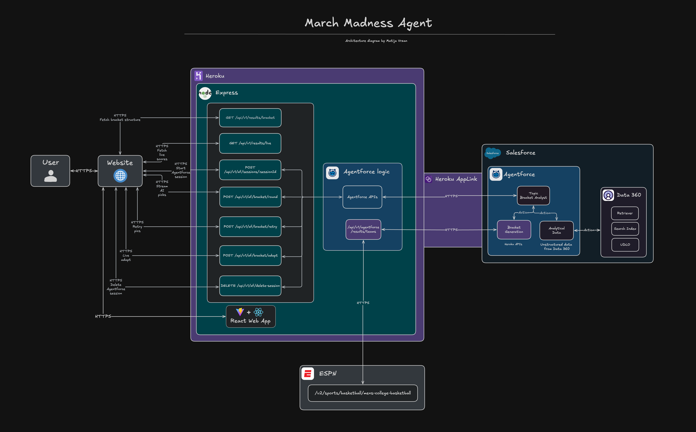

<p align="center">
<a href="https://www.salesforce.com/agentforce/"></a>
<a href="https://www.salesforce.com/data/"></a>
<a href="https://www.heroku.com/"></a>
<p/>

# March Madness with Agentforce, Data360, and Heroku

A full-stack NCAA March Madness bracket builder where you compete head-to-head against a **Salesforce Agentforce** AI agent that streams its predictions and reasoning in real time using live ESPN data.

> **Note:** This project requires a Salesforce org with Agentforce enabled and a Heroku app with the Heroku AppLink add-on attached.

---

# Table of Contents

- [March Madness with Agentforce, Data360, and Heroku](#march-madness-with-agentforce-data360-and-heroku)
- [Table of Contents](#table-of-contents)
  - [What does it do?](#what-does-it-do)
  - [How does it work?](#how-does-it-work)
  - [Demo](#demo)
    - [Architecture Diagram](#architecture-diagram)
    - [Home Page](#home-page)
    - [Manual Bracket Builder](#manual-bracket-builder)
    - [AI Bracket Generation (Streaming)](#ai-bracket-generation-streaming)
    - [Live Scores](#live-scores)
    - [Head-to-Head Comparison](#head-to-head-comparison)
  - [API Specification](#api-specification)
    - [Authentication](#authentication)
    - [Middleware](#middleware)
    - [Agentforce Session Routes](#agentforce-session-routes)
    - [Agentforce Messaging Routes](#agentforce-messaging-routes)
    - [Results Routes](#results-routes)
    - [Bracket Routes](#bracket-routes)
  - [Tech Stack](#tech-stack)
- [Configuration](#configuration)
  - [Prerequisites](#prerequisites)
  - [Local Environment Configuration](#local-environment-configuration)
  - [Environment Variables](#environment-variables)
    - [Server (`server/src/.env`)](#server-serversrcenv)
    - [Client (`client/.env`)](#client-clientenv)
  - [Salesforce Agentforce Configuration](#salesforce-agentforce-configuration)
    - [Agent Setup](#agent-setup)
    - [Agent Tools](#agent-tools)
  - [Deployment](#deployment)
    - [1. Set Configuration Variables](#1-set-configuration-variables)
    - [2. Deploy](#2-deploy)
- [License](#license)
- [Disclaimer](#disclaimer)

---

## What does it do?

This application lets users build their own March Madness bracket and then pits it against an AI agent powered by Salesforce Agentforce. The AI streams its picks and reasoning round by round — you can watch it think in real time. Once the tournament is underway, the app pulls live scores from ESPN so the AI can adapt its remaining predictions based on actual results.

The demo showcases two operational modes:

**Human Bracket Builder** — A manual bracket where you select winners through all 6 rounds:

- Full 64-team tournament bracket across 4 regions (East, West, South, Midwest)
- Pick winners for every matchup from the Round of 64 through the Championship
- Picks are auto-saved and persisted across page refreshes
- Live ESPN data feeds bracket seedings and scores in real time

**AI Bracket Generation** — Agentforce generates a complete bracket via streaming:

- 8 sequential prompts sent to the Agentforce agent (one per region for Round of 64, then Round of 32, Sweet 16, Elite 8, Final Four + Championship)
- Picks stream back in real time via Server-Sent Events (SSE)
- The AI's full reasoning is rendered as markdown in a side panel
- If the agent misses any matchups, a targeted retry regenerates only the missing picks

Key capabilities:

- **Live ESPN Integration**: Tournament data, seedings, and live scores pulled directly from the ESPN API with in-process TTL caching
- **Streaming AI Predictions**: Agentforce responses stream token-by-token via SSE — picks are extracted on-the-fly using regex pattern matching
- **Adaptive AI**: After real tournament rounds complete, the AI reviews the results and adjusts its remaining predictions accordingly
- **Head-to-Head Scoring**: Compare your bracket against the AI's bracket scored against actual ESPN results using exponential round points (1 → 2 → 4 → 8 → 16 → 32, max 192 points)
- **Persistent State**: User picks and AI reasoning survive page navigation and refreshes via localStorage
- **Heroku AppLink Auth**: Salesforce OAuth tokens are retrieved securely via the Heroku AppLink SDK — no credentials stored in environment variables

---

## How does it work?

**AI Bracket Generation Flow:**

1. **Session Init**: The frontend generates a UUID session ID and calls `POST /api/v1/af/sessions/:sessionId` to open an Agentforce session
2. **Auth via AppLink**: The backend uses the `@heroku/applink` SDK to retrieve a Salesforce OAuth access token and instance URL at request time
3. **Round Prompt**: The frontend calls `POST /api/v1/af/bracket/round` with the current round and region context
4. **Agent Call**: The backend constructs a prompt with the full matchup list and forwards it to the Agentforce Sessions API (`/einstein/ai-agent/v1/sessions/{id}/messages/stream`)
5. **SSE Streaming**: Agentforce streams the response chunk-by-chunk; the backend proxies this stream directly to the frontend via SSE
6. **Pick Extraction**: The frontend's `useSSE` hook accumulates text chunks and extracts picks in real time using the pattern `PICK: [matchupId] -> [winnerId]`
7. **Retry Logic**: After each round, any matchups the agent missed are collected and a targeted `POST /api/v1/af/bracket/retry` re-prompts the agent for only those picks
8. **Repeat**: Steps 3–7 repeat for all 8 prompts until the full bracket is complete
9. **Session Cleanup**: On page unmount, `DELETE /api/v1/delete-session` closes the Agentforce session

**Manual Bracket + Live Scoring Flow:**

1. **Bracket Load**: The frontend fetches the full bracket structure from `GET /api/v1/agentforce/results/bracket`, which queries the ESPN Scoreboard API and maps games to the internal tournament model
2. **ESPN Cache**: The ESPN service caches bracket data for 5 minutes and live scores for 30 seconds to avoid hammering the API on low-RAM Heroku dynos
3. **User Picks**: As users select winners, picks are saved to localStorage and periodically saved to the backend via `POST /bracket/save`
4. **Live Polling**: The `useLivePolling` hook polls `GET /api/v1/agentforce/results/live` every N seconds to refresh scores for in-progress games
5. **Adaptive AI**: On the Live page, the AI can review completed round results and call `POST /api/v1/af/bracket/round` again with actual outcomes to adjust remaining picks
6. **Scoring**: The Compare page scores both brackets locally against real ESPN results — no additional server call needed

---

## Demo

### Architecture Diagram



### Home Page


### Manual Bracket Builder


### AI Bracket Generation (Streaming)


### Live Scores


### Head-to-Head Comparison


---

## API Specification

### Authentication

All Agentforce-facing routes authenticate via [Heroku AppLink](https://devcenter.heroku.com/articles/applink). The backend SDK (`@heroku/applink`) retrieves a short-lived Salesforce OAuth access token at request time using the `APP_LINK_CONNECTION_NAME` attachment. No token is stored in environment variables.

Inbound requests from Salesforce (tool invocations on `agentforceTools` routes) are validated using HMAC signature verification against the `API_SECRET` shared secret. Invalid signatures return `401 Unauthorized`.

### Middleware

| Middleware          | Applies To               | Purpose                                                         |
| ------------------- | ------------------------ | --------------------------------------------------------------- |
| `cors`              | All routes               | Restricts browser requests to the origin set in `CLIENT_ORIGIN` |
| `express.json`      | All routes               | Parses JSON request bodies                                      |
| `validateSignature` | `agentforceTools` routes | HMAC-validates inbound Salesforce agent tool requests           |
| `herokuServiceMesh` | Selected routes          | Heroku service mesh integration                                 |
| `errorHandler`      | All routes (last)        | Centralized JSON error responses                                |

### Agentforce Session Routes

**`POST /api/v1/af/sessions/:sessionId`**

- **Auth required**: Yes (AppLink)
- **Description**: Opens a new Agentforce agent session with the provided external session key
- **URL params**: `sessionId` — UUID identifying the client session
- **Response**: `200 { sessionId, messages }`
- **Error responses**: `500` if AppLink auth or Agentforce API fails

**`DELETE /api/v1/delete-session`**

- **Auth required**: Yes (AppLink)
- **Description**: Closes an active Agentforce session
- **Request body**: `{ sessionId: string }`
- **Response**: `200 { message }`
- **Error responses**: `500` if session deletion fails

### Agentforce Messaging Routes

**`POST /api/v1/send-streaming-message`**

- **Auth required**: Yes (AppLink)
- **Description**: Sends a message to an active Agentforce session and streams the response back as SSE
- **Request body**: `{ sessionId: string, message: string, sequenceId: number }`
- **Response**: `text/event-stream` — chunked SSE with `data:` lines containing agent text chunks
- **Error responses**: `500` if Agentforce API returns a non-200 status

**`POST /api/v1/af/bracket/round`**

- **Auth required**: Yes (AppLink)
- **Description**: Generates AI bracket picks for a specific round by prompting the Agentforce agent; streams picks back via SSE
- **Request body**: `{ sessionId: string, sequenceId: number, round: string, matchups: Matchup[] }`
- **Response**: `text/event-stream`
- **Error responses**: `400` if required fields are missing, `500` on agent error

**`POST /api/v1/af/bracket/retry`**

- **Auth required**: Yes (AppLink)
- **Description**: Retries AI pick generation for specific matchups the agent previously missed
- **Request body**: `{ sessionId: string, sequenceId: number, matchups: Matchup[] }`
- **Response**: `text/event-stream`
- **Error responses**: `400`, `500`

### Results Routes

**`GET /api/v1/agentforce/results/teams`**

- **Auth required**: No
- **Description**: Returns all 64 tournament teams with seedings and regions
- **Response**: `200 { teams: Team[] }`

**`GET /api/v1/agentforce/results/bracket`**

- **Auth required**: No
- **Description**: Returns the full bracket structure from ESPN (cached 5 min) or falls back to static 2025 data
- **Response**: `200 { bracket: Bracket, isLive: boolean }`

**`GET /api/v1/agentforce/results/live`**

- **Auth required**: No
- **Description**: Returns live game scores and statuses from ESPN (cached 30 sec)
- **Response**: `200 { games: LiveGame[] }`

### Bracket Routes

**`POST /bracket/save`**

- **Auth required**: No
- **Description**: Saves a user's bracket picks to the server-side in-memory store
- **Request body**: `{ sessionId: string, picks: Record<string, string> }`
- **Response**: `200 { message }`

**`GET /bracket/:id`**

- **Auth required**: No
- **Description**: Retrieves a previously saved bracket by session ID
- **URL params**: `id` — session ID
- **Response**: `200 { bracket: Bracket }` or `404` if not found

**`GET /bracket/:id/score`**

- **Auth required**: No
- **Description**: Scores a saved bracket against the current ESPN results
- **URL params**: `id` — session ID
- **Response**: `200 { score: number, breakdown: RoundScores }` or `404` if bracket not found

---

## Tech Stack

| Layer    | Technology                                                                                                                                    | Description                                                          |
| -------- | --------------------------------------------------------------------------------------------------------------------------------------------- | -------------------------------------------------------------------- |
| Frontend | [React 19](https://react.dev), [Vite](https://vite.dev), [Tailwind CSS 4](https://tailwindcss.com), [React Router 7](https://reactrouter.com) | UI library, build tool, utility-first CSS, client-side routing       |
| Frontend | [React Markdown](https://github.com/remarkjs/react-markdown), [Lucide React](https://lucide.dev), [UUID](https://github.com/uuidjs/uuid)      | Markdown rendering for AI reasoning, icons, session ID generation    |
| Backend  | [Node.js](https://nodejs.org), [Express 5](https://expressjs.com), [TypeScript 5](https://www.typescriptlang.org)                             | JavaScript runtime, web framework, static typing                     |
| AI / LLM | [Salesforce Agentforce](https://www.salesforce.com/agentforce/), [Salesforce Data360](https://www.salesforce.com/data/)                       | Autonomous AI agent platform, data cloud backend for agent knowledge |
| Auth     | [Heroku AppLink](https://devcenter.heroku.com/articles/applink)                                                                               | Secure Salesforce OAuth token retrieval without storing credentials  |
| Data     | [ESPN API](https://www.espn.com)                                                                                                              | Real-time tournament bracket, scores, and game statuses              |
| Hosting  | [Heroku](https://www.heroku.com)                                                                                                              | Cloud platform for both frontend static assets and backend API       |

---

# Configuration

## Prerequisites

To run this application locally, you will need the following:

- **Node.js** v22 or later installed (run `node -v` to check). Follow the [Node.js install instructions](https://nodejs.org/en/download) if needed
- **npm** v10 or later installed (run `npm -v` to check). Node.js includes `npm`
- **git** installed. Follow the instructions to [install git](https://git-scm.com/downloads)
- A **Salesforce org** with [Agentforce](https://www.salesforce.com/agentforce/) enabled and an agent deployed
- A **Heroku account** with an app that has the [Heroku AppLink](https://devcenter.heroku.com/articles/applink) add-on attached and connected to your Salesforce org
- (Optional) A **Salesforce Data360** account if your agent uses Data Cloud as a knowledge source

## Local Environment Configuration

1. **Clone the repository**

   ```bash
   git clone https://github.com/your-org/salesforce-agentforce-march-madness.git
   cd salesforce-agentforce-march-madness
   ```

2. **Configure Salesforce Agentforce**

   > **Important**: You must have a Salesforce org with Agentforce enabled before proceeding.

   Follow the [Agentforce documentation](https://help.salesforce.com/s/articleView?id=sf.agentforce_setup.htm) to:
   - Create and deploy an Agentforce agent in your Salesforce org
   - Note the **Agent ID** from the agent's detail page — you will need it for `AGENTFORCE_AGENT_ID`

3. **Configure Heroku AppLink**

   > **Important**: Heroku AppLink is required for the backend to authenticate with Salesforce. It does not work with a plain `.env` file in production.

   Follow the [Heroku AppLink setup guide](https://devcenter.heroku.com/articles/applink) to:
   - Attach the AppLink add-on to your Heroku app
   - Connect the add-on to your Salesforce org
   - Note the **connection name** — this is your `APP_LINK_CONNECTION_NAME` value

4. **Configure environment variables**

   **Server:**

   ```bash
   cp server/src/.env.example server/src/.env
   ```

   Open `server/src/.env` and fill in all required values (see [Environment Variables](#environment-variables)).

   **Client:**

   ```bash
   cp client/.env.example client/.env
   ```

   Open `client/.env` and fill in all required values.

   Generate a shared secret for signature validation if needed:

   ```bash
   node -e "console.log(require('crypto').randomBytes(32).toString('hex'))"
   ```

   ⚠️ **Note**: `API_SECRET` in `server/src/.env` and `VITE_API_SECRET` in `client/.env` must match exactly.

5. **Install dependencies**

   Install all workspace dependencies from the root:

   ```bash
   # Server
   cd server && npm install && cd ..

   # Client
   cd client && npm install && cd ..
   ```

6. **Start the application**

   Open two terminals:

   ```bash
   # Terminal 1 — backend
   cd server
   npm run dev
   ```

   ```bash
   # Terminal 2 — frontend
   cd client
   npm run dev
   ```

7. **Access the application**

   Once both servers are running, open your browser and navigate to `http://localhost:5173`.

## Environment Variables

### Server (`server/src/.env`)

| Variable                   | Required | Description                                                                |
| -------------------------- | -------- | -------------------------------------------------------------------------- |
| `APP_PORT`                 | No       | Port the Express server listens on locally. Defaults to `3000`             |
| `CLIENT_ORIGIN`            | No       | CORS-allowed origin for the frontend. Defaults to `http://localhost:5173`  |
| `APP_LINK_CONNECTION_NAME` | Yes      | Heroku AppLink connection name used to retrieve Salesforce OAuth tokens    |
| `AGENTFORCE_AGENT_ID`      | Yes      | Salesforce Agentforce Agent ID from your org's agent configuration page    |
| `API_SECRET`               | Yes      | Shared HMAC secret used to validate inbound Salesforce agent tool requests |

### Client (`client/.env`)

| Variable          | Required | Description                                                       |
| ----------------- | -------- | ----------------------------------------------------------------- |
| `VITE_API_BASE`   | No       | Base URL for the backend API. Defaults to `http://localhost:3000` |
| `VITE_API_SECRET` | Yes      | Must match `API_SECRET` on the server for signature validation    |

## Salesforce Agentforce Configuration

### Agent Setup

The application communicates with Agentforce using the [Einstein AI Agent Sessions API](https://developer.salesforce.com/docs/einstein/genai/references/ai-agent-sessions-api-overview). Your Agentforce agent must be:

- Published and active in your Salesforce org
- Accessible by the AppLink-connected user profile
- Configured with appropriate knowledge sources (Data360 recommended for team statistics and historical NCAA data)

### Agent Tools

The server exposes tool endpoints under `agentforceTools` routes that Salesforce agents can call back into the application. These endpoints are protected by HMAC signature validation using the shared `API_SECRET`.

---

## Deployment

This project is deployed on Heroku. The root `package.json` `start` script handles the full build and launch sequence — Heroku runs it automatically on each deploy.

### 1. Set Configuration Variables

Set each server environment variable as a Heroku config var:

```bash
heroku config:set APP_LINK_CONNECTION_NAME=your_connection_name
heroku config:set AGENTFORCE_AGENT_ID=your_agent_id
heroku config:set API_SECRET=your_api_secret
heroku config:set CLIENT_ORIGIN=https://your-app-name.herokuapp.com
```

`PORT` is set automatically by Heroku — do not override it.

### 2. Deploy

```bash
git push heroku main
```

Heroku runs `npm install` and then `npm start` from the root automatically. The `start` script builds the React client, moves the compiled assets into `server/public`, and starts the Express server. The Express server then serves both the API and the React SPA.

---

# License

[MIT](http://www.opensource.org/licenses/mit-license.html)

---

# Disclaimer

This software is to be considered "sample code", a Type B Deliverable, and is delivered "as-is" to the user. Salesforce bears no responsibility to support the use or implementation of this software.
